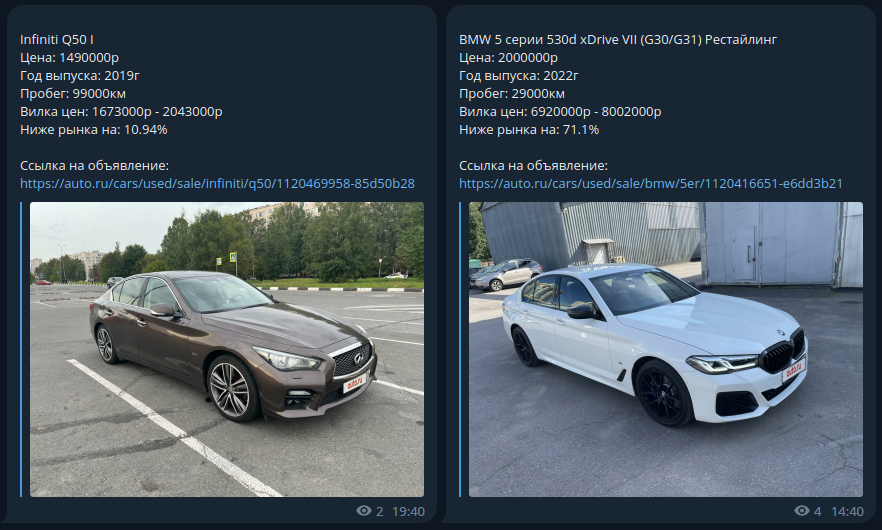

# Cheap Car Adv Poster Bot: Automatic search and post for profitable car sales offers.


# Description
This tool is designed to parse advertisements for cars being sold on free boards, filter out only the most profitable offers with prices much lower than the average, and automatically post them to your TG channel using a scheduler.

---
# Stack
* ```Python```
* ```Aiogram```
* ```Asyncio```
* ```Selenium```
* ```Apscheduler```
---
# Installation
* Download the project
````
git clone https://github.com/voodoopecker/cheap_cars_adv.git
````
* Install dependencies (create and activate a virtual environment first if you use it)
````
pip install -r requirements.txt
````
---
# Usage
* Prepare your bot:
  * Create bot using BotFather: https://t.me/BotFather
  * Add it to your channel with admin rights

* Create .env file in the same folder with all these constants filled with your private data:
  * ```TOKEN: str = '3452345344:DSA5-dfgKd3JAoQ7rj2D3NVRoQ0Qs-zx5Yp'``` - your bot token taken from BotFather
  * ```ADMIN_ID: int = 6786786734``` - telegram account ID who controls bot
  * ```GROUP_ID: int = -1007638736412``` - telegram group ID where posts send
  * ```MAIN_LINK: str = 'https://XautoX.ru/moscow/cars'``` - source page link from where data scraps

* Set bot settings in settings.py:
  * ```SCHEDULER_TIME``` - interval between runs in seconds

* Run bot:
  * If you use a virtual environment, you need to activate it.
  * Run ```python3 main_cheap_cars.py```
